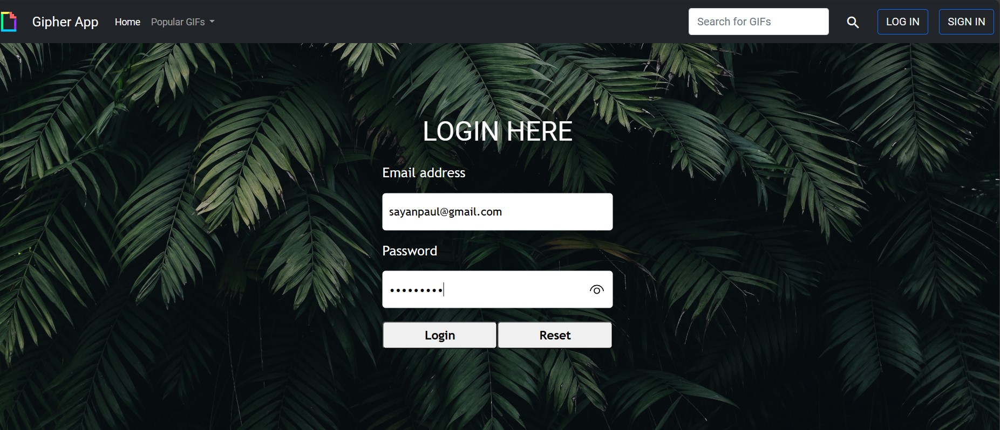

# Gipher App

• Web Application to search for GIF images
and add them to wish list. It supports SignUp,
Login, Logout, Search GIF, add GIF to wishlist
and CRUD operations.

• User can search any GIF. Some predefined categories are also there based on which user can search the GIFs. User can add any GIF into his/her wishlist, check out those anytime and also remove those from wishlist.

• It uses JWT to authenticate the user. For storing user information it uses MySQL database and for storing saved items by users it uses NoSQL like Mongo DB. It also handles external api calls at the backend. It follows proper Microservice architecture to manage the project.

## Tech Stack

**Client:** Bootstrap, Typescript, Angular

**Server:** Java, Spring Boot, MySQL, MongoDB, Netflix Eureka

## Screenshots
Project Architecture : 

Project Flow : 

User Registration Page : 

User Login Page : 

Home Page : 

User Wishlist Page : 

User Edit Profile Page : 

